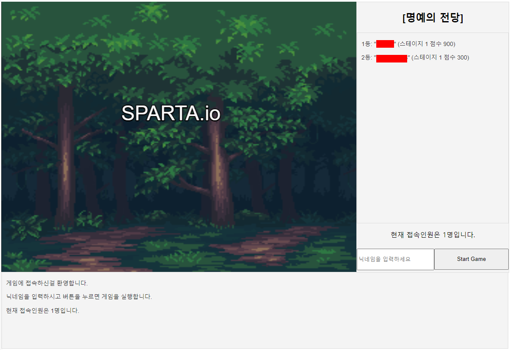
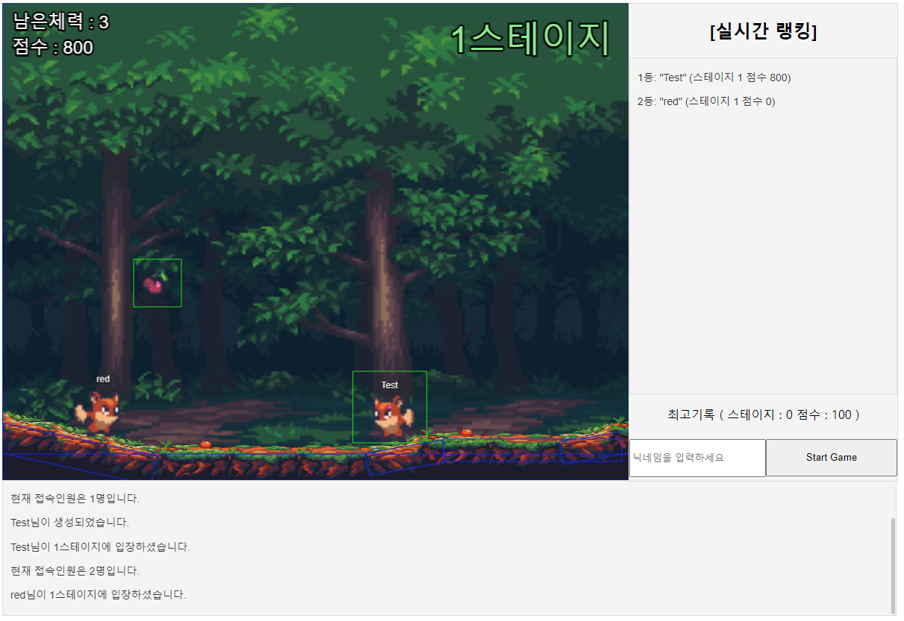

# 1. Architecture

```
📦public
 ┣ 📂assets
 ┣ 📂scenes
 ┃ ┣ 📜main.scene.js
 ┃ ┣ 📜preload.scene.js
 ┃ ┣ 📜stage1.scene.js
 ┃ ┣ 📜stage2.scene.js
 ┃ ┣ 📜stage3.scene.js
 ┃ ┣ 📜stage4.scene.js
 ┃ ┗ 📜stage5.scene.js
 ┣ 📜constants.js
 ┣ 📜gameLogMessge.js
 ┣ 📜index.html
 ┣ 📜index.js
 ┣ 📜nickname.js
 ┣ 📜scene.manager.js
 ┣ 📜socket.manager.js
 ┗ 📜usersMessage.js
```

```
📦src
 ┣ 📂handlers
 ┃ ┣ 📂stage
 ┃ ┃ ┣ 📜stage1.handler.js
 ┃ ┃ ┣ 📜stage2.handler.js
 ┃ ┃ ┣ 📜stage3.handler.js
 ┃ ┃ ┣ 📜stage4.handler.js
 ┃ ┃ ┗ 📜stage5.handler.js
 ┃ ┣ 📜handlerMapping.js
 ┃ ┣ 📜helper.js
 ┃ ┣ 📜nickname.handler.js
 ┃ ┣ 📜rankings.handler.js
 ┃ ┣ 📜spawnItem.handler.js
 ┃ ┗ 📜stage.manager.handler.js
 ┣ 📂init
 ┃ ┗ 📜socket.js
 ┣ 📂models
 ┃ ┣ 📂objects
 ┃ ┃ ┣ 📜items.js
 ┃ ┃ ┗ 📜monsters.js
 ┃ ┗ 📂sessions
 ┃ ┃ ┗ 📜socketUser.js
 ┣ 📂utils
 ┃ ┗ 📜redisManager.js
 ┣ 📜constants.js
 ┗ 📜main-server.js
```

# 2. 기능소개

## 1. 처음 화면 



1. 메인 화면은 크게 게임화면, 랭킹, 게임로그 부분으로 나뉩니다.

2. 게임화면은 타이틀 애니메이션이 실행됩니다.

3. 랭킹은 누적한 정보를 가지고 랭킹을 표시하는 구역입니다.

4. 랭킹 영역에는 현재 접속 인원과 게임 시작 버튼이 있습니다.

5. 게임 시작은 닉네임을 입력해야 시작이 가능합니다.

6. 게임 로그는 접속한 인원, 유저의 스테이지, 나간 유저의 기록을 표시합니다.


## 2. 게임 화면 



1. 게임 화면은 점수, 스테이지, 랭킹, 게임로그로 나뉩니다.

2. 게임 화면의 좌측 상단에는 점수가, 우측 상단에는 스테이지가 표시됩니다.

3. 랭킹은 유저들이 아이템을 먹을 때 실시간으로 반영됩니다.

4. 랭킹 아래에는 유저의 최고 기록이 표시됩니다.

6. 게임 로그는 접속한 인원, 유저의 스테이지, 나간 유저의 기록을 표시합니다.


# 3. Technologies Used


[](https://skillicons.dev)